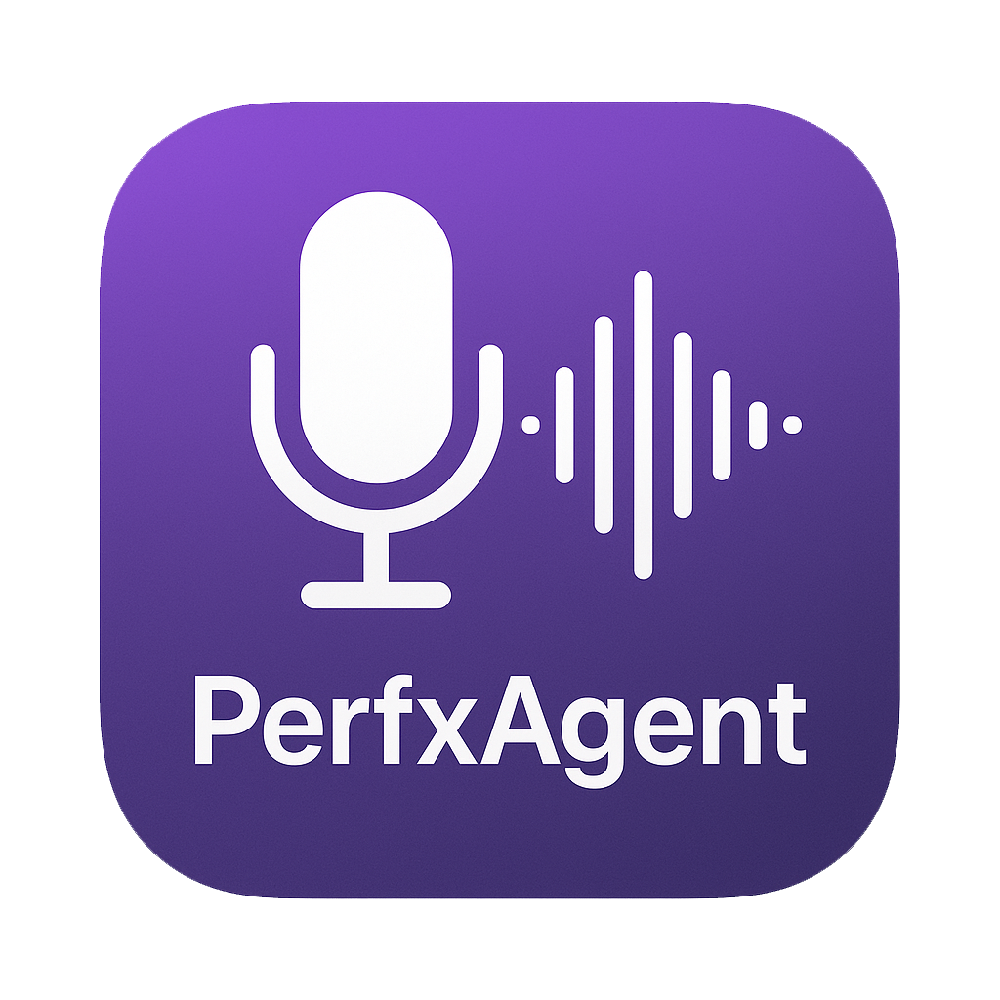

# PerfxAgent-ASR 🎤

<div align="center">



**一个基于Qt6的跨平台桌面应用程序，专注于音频处理、实时语音识别(ASR)和智能转录功能**


**A Qt6-based cross-platform desktop application focused on audio processing, real-time speech recognition (ASR), and intelligent transcription features**

[](https://github.com/manwjh/perfxagent-app)
[](https://www.qt.io/)
[](https://isocpp.org/)
[](https://github.com/manwjh/perfxagent-app)
[](LICENSE)

[English](#perfxagent-asr-) | [中文](#perfxagent-asr--1)

</div>

---

## 🌟 主要特性 / Key Features

### 🎤 音频处理 / Audio Processing
- **高质量录制**: 支持多种音频格式的录制和播放
- **格式转换**: 自动音频格式转换和优化
- **实时处理**: 流式音频数据处理和分析
- **设备管理**: 智能音频设备检测和管理

### 🗣️ 语音识别 / Speech Recognition
- **实时ASR**: 集成火山引擎ASR服务，支持实时语音转文字
- **多语言支持**: 支持中文、英文等多种语言识别
- **高精度**: 先进的语音识别算法，提供高准确率
- **流式处理**: 支持实时流式语音识别

### 📝 智能转录 / Intelligent Transcription
- **歌词同步**: 支持LRC格式的歌词同步功能
- **多格式导出**: 支持LRC、JSON、TXT等多种导出格式
- **智能分段**: 自动音频分段和文本对齐
- **实时预览**: 转录结果实时预览和编辑

### 🎨 用户界面 / User Interface
- **现代化设计**: 基于Qt6的现代化图形界面
- **多窗口管理**: 支持多窗口同时工作
- **响应式布局**: 自适应不同屏幕尺寸
- **主题支持**: 支持深色/浅色主题切换

### ⚡ 性能优化 / Performance
- **异步处理**: 多线程异步音频处理
- **内存优化**: 高效的内存管理和资源使用
- **网络优化**: 基于IXWebSocket的稳定网络通信
- **缓存机制**: 智能缓存提升响应速度

---

## 🛠️ 系统要求 / System Requirements

### 最低要求 / Minimum Requirements
- **操作系统**: macOS 10.15+ / Ubuntu 18.04+ / Windows 10+
- **内存**: 4GB RAM
- **存储**: 2GB 可用空间
- **网络**: 稳定的互联网连接

### 开发环境 / Development Environment
- **编译器**: 支持C++17的编译器 (Apple Clang 12+ / GCC 7+ / MSVC 2019+)
- **CMake**: 3.10或更高版本
- **Qt**: Qt6 (Core, Widgets, Network, Gui, Multimedia, WebEngineWidgets, WebSockets, Concurrent, PrintSupport)

---

## 🚀 快速开始 / Quick Start

### 📦 一键安装 / One-Click Installation

#### macOS用户 / macOS Users
```bash
# 使用Homebrew安装依赖
brew install qt@6 openssl@3 portaudio boost opus libogg nlohmann-json websocketpp asio opencv libsndfile

# 克隆项目
git clone https://github.com/manwjh/perfxagent-app.git
cd perfxagent-app

# 一键构建和运行
./scripts/build_dev.sh
```

#### Linux用户 / Linux Users
```bash
# Ubuntu/Debian
sudo apt-get update
sudo apt-get install qt6-base-dev libssl-dev portaudio19-dev libboost-all-dev libopus-dev libogg-dev nlohmann-json3-dev libwebsocketpp-dev libasio-dev libopencv-dev libsndfile1-dev

# 克隆和构建
git clone https://github.com/manwjh/perfxagent-app.git
cd perfxagent-app
./scripts/build_dev.sh
```

### 🔧 手动构建 / Manual Build

#### 1. 准备环境 / Environment Setup
```bash
# 克隆项目
git clone https://github.com/manwjh/perfxagent-app.git
cd perfxagent-app

# 创建构建目录
mkdir build && cd build
```

#### 2. 配置项目 / Configure Project
```bash
# 开发模式（推荐）
cmake .. -DCMAKE_BUILD_TYPE=Debug

# 或生产模式
cmake .. -DCMAKE_BUILD_TYPE=Release
```

#### 3. 编译项目 / Build Project
```bash
# 编译
make -j$(nproc)

# 或使用多核编译
make -j$(sysctl -n hw.ncpu)  # macOS
make -j$(nproc)              # Linux
```

#### 4. 运行应用 / Run Application
```bash
# 返回项目根目录
cd ..

# 运行应用
./build/bin/PerfxAgent-ASR.app/Contents/MacOS/PerfxAgent-ASR
```

---

## 🎯 核心功能 / Core Features

### 🎤 音频转文字 / Audio to Text
- **文件导入**: 支持WAV、MP3、FLAC、OGG等多种格式
- **批量处理**: 支持批量音频文件处理
- **格式转换**: 自动音频格式优化
- **结果导出**: 支持多种导出格式

### 🗣️ 实时语音识别 / Real-time Speech Recognition
- **实时录制**: 支持实时音频录制
- **流式识别**: 实时语音转文字
- **波形显示**: 实时音频波形可视化
- **结果累积**: 智能文本累积和分段

### 📊 音频分析 / Audio Analysis
- **波形显示**: 实时音频波形图
- **频谱分析**: 音频频谱分析
- **音量检测**: 自动音量检测和调节
- **质量评估**: 音频质量评估

### ⚙️ 系统配置 / System Configuration
- **API配置**: 火山引擎ASR API配置
- **音频设置**: 音频设备和参数配置
- **界面设置**: 界面主题和布局配置
- **导出设置**: 导出格式和参数配置

---

## 📁 项目结构 / Project Structure

```
perfxagent-app/
├── 📁 include/                    # 头文件 / Header files
│   ├── 🎤 asr/                   # 语音识别模块 / ASR module
│   │   ├── asr_client.h          # ASR客户端 / ASR client
│   │   ├── asr_manager.h         # ASR管理器 / ASR manager
│   │   ├── asr_debug_config.h    # 调试配置 / Debug config
│   │   └── asr_log_utils.h       # 日志工具 / Log utilities
│   ├── 🔊 audio/                 # 音频处理模块 / Audio module
│   │   ├── audio_manager.h       # 音频管理器 / Audio manager
│   │   ├── audio_device.h        # 音频设备 / Audio device
│   │   ├── audio_processor.h     # 音频处理器 / Audio processor
│   │   ├── audio_thread.h        # 音频线程 / Audio thread
│   │   ├── audio_types.h         # 类型定义 / Type definitions
│   │   └── file_importer.h       # 文件导入器 / File importer
│   ├── 🧠 logic/                 # 业务逻辑 / Business logic
│   │   └── realtime_transcription_controller.h # 实时转录控制器
│   └── 🖥️ ui/                    # 用户界面 / User interface
│       ├── main_window.h         # 主窗口 / Main window
│       ├── audio_to_text_window.h # 音频转文字窗口
│       ├── realtime_audio_to_text_window.h # 实时转录窗口
│       ├── config_manager.h      # 配置管理器 / Config manager
│       ├── global_state.h        # 全局状态 / Global state
│       └── app_icon_button.h     # 应用图标按钮 / App icon button
├── 📁 src/                       # 源代码 / Source code
│   ├── 🎤 asr/                   # ASR实现 / ASR implementation
│   ├── 🔊 audio/                 # 音频处理实现 / Audio implementation
│   ├── 🧠 logic/                 # 业务逻辑实现 / Logic implementation
│   ├── 🖥️ ui/                    # UI实现 / UI implementation
│   ├── main.cpp                  # 主程序入口 / Main entry
│   └── main.js                   # Electron主进程 / Electron main
├── 📁 resources/                 # 资源文件 / Resource files
│   ├── 🎨 icons/                 # 应用图标 / Application icons
│   ├── 🖼️ images/                # 图片资源 / Image resources
│   ├── 🔤 fonts/                 # 字体文件 / Font files
│   └── resources.qrc             # Qt资源文件 / Qt resource file
├── 📁 scripts/                   # 工具脚本 / Utility scripts
│   ├── build_dev.sh              # 开发构建脚本 / Dev build script
│   ├── build_package.sh          # 打包脚本 / Packaging script
│   ├── icon_generator.sh         # 图标生成脚本 / Icon generator
│   ├── sign_and_notarize.sh      # 签名脚本 / Signing script
│   └── 📁 platforms/             # 平台特定脚本 / Platform scripts
├── 📁 third_party/              # 第三方库 / Third-party libraries
│   └── ixwebsocket/             # IXWebSocket库 / IXWebSocket library
├── 📁 cmake/                    # CMake配置 / CMake configuration
├── 📁 config/                   # 配置文件 / Configuration files
├── 📁 data/                     # 数据文件 / Data files
├── 📁 sample/                   # 示例文件 / Sample files
├── 📁 docs/                     # 文档 / Documentation
├── 📁 HISTORY/                  # 项目历史 / Project history
├── CMakeLists.txt               # CMake主配置 / Main CMake config
├── package.json                 # Electron配置 / Electron config
└── README.md                    # 项目说明 / Project README
```

---

## 🔧 配置指南 / Configuration Guide

### 🔑 API密钥配置 / API Key Configuration

#### 1. 获取火山引擎ASR API密钥 / Get Volcengine ASR API Keys
1. 访问 [火山引擎控制台](https://console.volcengine.com/)
2. 创建应用并获取 `AppID`、`AccessToken`、`SecretKey`
3. 确保账户有足够的ASR服务额度

#### 2. 配置方式 / Configuration Methods

**方式1: 环境变量（推荐） / Environment Variables (Recommended)**
```bash
export ASR_APP_ID="your_app_id"
export ASR_ACCESS_TOKEN="your_access_token"
export ASR_SECRET_KEY="your_secret_key"
```

**方式2: 配置文件 / Configuration File**
```bash
# 复制模板文件
cp config/api_keys_template.json config/api_keys.json

# 编辑配置文件
vim config/api_keys.json
```

**方式3: UI界面配置 / UI Configuration**
- 在应用程序的"系统配置"界面中设置
- 配置自动保存到 `~/.perfxagent/asr_config.json`

**方式4: 混淆配置（体验模式） / Obfuscated Config (Trial Mode)**
```bash
# 生成混淆配置
python3 scripts/generate_obfuscated_keys.py
```

### ⚙️ 音频配置 / Audio Configuration

#### 推荐配置 / Recommended Settings
```cpp
audio::AudioConfig config;
config.sampleRate = 16000;        // 采样率 / Sample rate
config.channels = ChannelCount::MONO;  // 单声道 / Mono channel
config.bitsPerSample = 16;        // 位深度 / Bit depth
config.format = EncodingFormat::WAV;   // 格式 / Format
```

#### ASR配置 / ASR Configuration
```cpp
Asr::AsrConfig config;
config.url = "wss://openspeech.bytedance.com/api/v3/sauc/bigmodel";
config.appId = "your_app_id";
config.accessToken = "your_access_token";
config.secretKey = "your_secret_key";
config.sampleRate = 16000;
config.language = "zh-CN";
```

---

## 🎵 支持格式 / Supported Formats

### 📁 音频格式 / Audio Formats
| 格式 / Format | 输入 / Input | 输出 / Output | 说明 / Description |
|---------------|--------------|---------------|-------------------|
| WAV | ✅ | ✅ | 无损音频格式 / Lossless audio |
| MP3 | ✅ | ❌ | 有损压缩格式 / Lossy compression |
| FLAC | ✅ | ❌ | 无损压缩格式 / Lossless compression |
| OGG | ✅ | ❌ | 开源音频格式 / Open source audio |
| Opus | ✅ | ✅ | 高效压缩格式 / Efficient compression |

### 📄 转录格式 / Transcription Formats
| 格式 / Format | 支持 / Support | 说明 / Description |
|---------------|----------------|-------------------|
| LRC | ✅ | 歌词同步格式 / Lyrics synchronization |
| JSON | ✅ | 结构化数据格式 / Structured data |
| TXT | ✅ | 纯文本格式 / Plain text |
| SRT | ✅ | 字幕格式 / Subtitle format |

---

## 🚀 使用指南 / Usage Guide

### 🎤 音频文件转文字 / Audio File to Text

1. **启动应用** / Launch Application
   ```bash
   ./build/bin/PerfxAgent-ASR.app/Contents/MacOS/PerfxAgent-ASR
   ```

2. **选择功能** / Select Feature
   - 点击"音频转文字"按钮
   - 或使用菜单栏选择相应功能

3. **导入文件** / Import File
   - 点击"选择文件"按钮
   - 选择要转换的音频文件
   - 支持拖拽导入

4. **开始转换** / Start Conversion
   - 点击"开始转换"按钮
   - 等待转换完成
   - 查看转换结果

5. **导出结果** / Export Results
   - 选择导出格式（LRC、JSON、TXT）
   - 选择保存位置
   - 点击"导出"按钮

### 🗣️ 实时语音识别 / Real-time Speech Recognition

1. **选择实时功能** / Select Real-time Feature
   - 点击"实时音频转文字"按钮
   - 进入实时识别界面

2. **配置音频设备** / Configure Audio Device
   - 选择输入设备
   - 调整音量设置
   - 测试音频输入

3. **开始识别** / Start Recognition
   - 点击"开始录制"按钮
   - 开始说话
   - 实时查看识别结果

4. **保存结果** / Save Results
   - 点击"停止录制"按钮
   - 选择保存格式
   - 导出识别结果

---

## 🔍 调试和故障排除 / Debugging and Troubleshooting

### 🐛 启用调试模式 / Enable Debug Mode

#### 方法1: 开发模式构建（推荐） / Development Build (Recommended)
```bash
# 自动启用所有调试功能
./scripts/build_dev.sh
```

#### 方法2: 环境变量调试 / Environment Variable Debug
```bash
# 设置调试环境变量
export ASR_DEBUG=1
export ASR_ENABLE_BUSINESS_LOG=1
export ASR_ENABLE_FLOW_LOG=1
export ASR_ENABLE_DATA_LOG=1
export ASR_ENABLE_PROTOCOL_LOG=1
export ASR_ENABLE_AUDIO_LOG=1

# 运行应用
./build/bin/PerfxAgent-ASR.app/Contents/MacOS/PerfxAgent-ASR
```

#### 方法3: 构建时调试 / Build-time Debug
```bash
# Debug构建
mkdir -p build && cd build
cmake .. -DCMAKE_BUILD_TYPE=Debug
make -j$(sysctl -n hw.ncpu)
cd ..
./build/bin/PerfxAgent-ASR.app/Contents/MacOS/PerfxAgent-ASR
```

### 🔧 常见问题 / Common Issues

#### 1. 音频设备问题 / Audio Device Issues
```bash
# 检查音频设备
system_profiler SPAudioDataType  # macOS
pactl list short sources          # Linux
```

#### 2. 网络连接问题 / Network Connection Issues
```bash
# 测试网络连接
ping openspeech.bytedance.com
curl -I https://openspeech.bytedance.com
```

#### 3. API密钥问题 / API Key Issues
```bash
# 验证API密钥
echo $ASR_APP_ID
echo $ASR_ACCESS_TOKEN
echo $ASR_SECRET_KEY
```

#### 4. 依赖库问题 / Dependency Issues
```bash
# 检查依赖库
brew list | grep -E "(qt|openssl|portaudio|boost|opus|ogg|nlohmann|websocketpp|asio|opencv|sndfile)"
```

---

## 📦 打包和分发 / Packaging and Distribution

### 🍎 macOS打包 / macOS Packaging

#### 创建应用包 / Create Application Package
```bash
# 一键打包
./scripts/build_package.sh

# 手动打包
cd build
cpack -G "DragNDrop;TGZ"
cd ..
```

#### 签名和公证 / Signing and Notarization
```bash
# 签名应用
./scripts/sign_and_notarize.sh

# 验证签名
codesign -dv --verbose=4 build/PerfxAgent-ASR.app
```

### 🐧 Linux打包 / Linux Packaging

#### 创建AppImage / Create AppImage
```bash
# 构建AppImage
./scripts/build_package.sh --appimage

# 或手动创建
cd build
cpack -G "TGZ"
cd ..
```

### 🪟 Windows打包 / Windows Packaging

#### 创建安装包 / Create Installer
```bash
# 交叉编译（从macOS）
./scripts/platforms/windows/cross_compile_from_macos.sh

# 或使用Windows环境
./scripts/platforms/windows/build_package.bat
```

---

## 📊 版本信息 / Version Information

| 项目 / Item | 版本 / Version | 说明 / Description |
|-------------|----------------|-------------------|
| **当前版本** / Current Version | **1.8.0** | 最新稳定版本 / Latest stable version |
| **Qt版本** / Qt Version | **Qt6** | 图形界面框架 / GUI framework |
| **C++标准** / C++ Standard | **C++17** | 编程语言标准 / Programming language standard |
| **支持平台** / Supported Platforms | **macOS, Linux, Windows** | 跨平台支持 / Cross-platform support |

---

## 🤝 贡献指南 / Contributing

我们欢迎所有形式的贡献！请查看以下指南：

### 🐛 报告问题 / Report Issues
1. 使用GitHub Issues报告bug
2. 提供详细的错误信息和复现步骤
3. 包含系统环境和版本信息

### 💡 功能建议 / Feature Requests
1. 在Issues中提出新功能建议
2. 描述功能需求和预期效果
3. 讨论实现方案和优先级

### 🔧 代码贡献 / Code Contributions
1. Fork项目到你的GitHub账户
2. 创建功能分支：`git checkout -b feature/AmazingFeature`
3. 提交更改：`git commit -m 'Add some AmazingFeature'`
4. 推送到分支：`git push origin feature/AmazingFeature`
5. 创建Pull Request

### 📝 文档贡献 / Documentation Contributions
1. 改进README文档
2. 添加代码注释
3. 编写使用教程
4. 翻译文档内容

---

## 📄 许可证 / License

本项目采用 [MIT许可证](LICENSE)。

```
MIT License

Copyright (c) 2024 深圳王哥

Permission is hereby granted, free of charge, to any person obtaining a copy
of this software and associated documentation files (the "Software"), to deal
in the Software without restriction, including without limitation the rights
to use, copy, modify, merge, publish, distribute, sublicense, and/or sell
copies of the Software, and to permit persons to whom the Software is
furnished to do so, subject to the following conditions:

The above copyright notice and this permission notice shall be included in all
copies or substantial portions of the Software.

THE SOFTWARE IS PROVIDED "AS IS", WITHOUT WARRANTY OF ANY KIND, EXPRESS OR
IMPLIED, INCLUDING BUT NOT LIMITED TO THE WARRANTIES OF MERCHANTABILITY,
FITNESS FOR A PARTICULAR PURPOSE AND NONINFRINGEMENT. IN NO EVENT SHALL THE
AUTHORS OR COPYRIGHT HOLDERS BE LIABLE FOR ANY CLAIM, DAMAGES OR OTHER
LIABILITY, WHETHER IN AN ACTION OF CONTRACT, TORT OR OTHERWISE, ARISING FROM,
OUT OF OR IN CONNECTION WITH THE SOFTWARE OR THE USE OR OTHER DEALINGS IN THE
SOFTWARE.
```

---

## 📞 支持与联系 / Support and Contact

### 📧 联系方式 / Contact Information
- **邮箱 / Email**: manwjh@126.com
- **GitHub**: [@manwjh](https://github.com/manwjh)
- **项目地址**: [perfxagent-app](https://github.com/manwjh/perfxagent-app)

### 🆘 获取帮助 / Get Help
1. **查看文档**: 仔细阅读README和项目文档
2. **搜索Issues**: 在GitHub Issues中搜索类似问题
3. **提交Issue**: 如果问题仍未解决，提交新的Issue
4. **联系作者**: 通过邮箱联系作者获取支持

### 📚 相关资源 / Related Resources
- [火山引擎ASR API文档](https://www.volcengine.com/docs/82379) / [Volcengine ASR API Documentation](https://www.volcengine.com/docs/82379)
- [Qt6官方文档](https://doc.qt.io/qt-6/) / [Qt6 Official Documentation](https://doc.qt.io/qt-6/)
- [IXWebSocket库文档](https://github.com/machinezone/IXWebSocket) / [IXWebSocket Library Documentation](https://github.com/machinezone/IXWebSocket)
- [CMake官方文档](https://cmake.org/documentation/) / [CMake Official Documentation](https://cmake.org/documentation/)

---

<div align="center">

**⭐ 如果这个项目对你有帮助，请给它一个星标！**

**⭐ If this project helps you, please give it a star!**

[](https://githu
